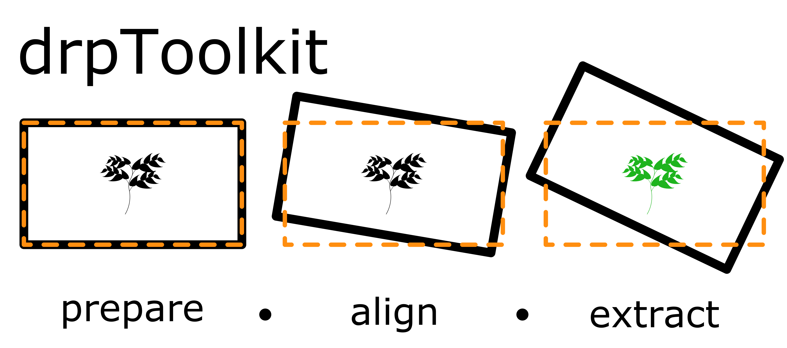
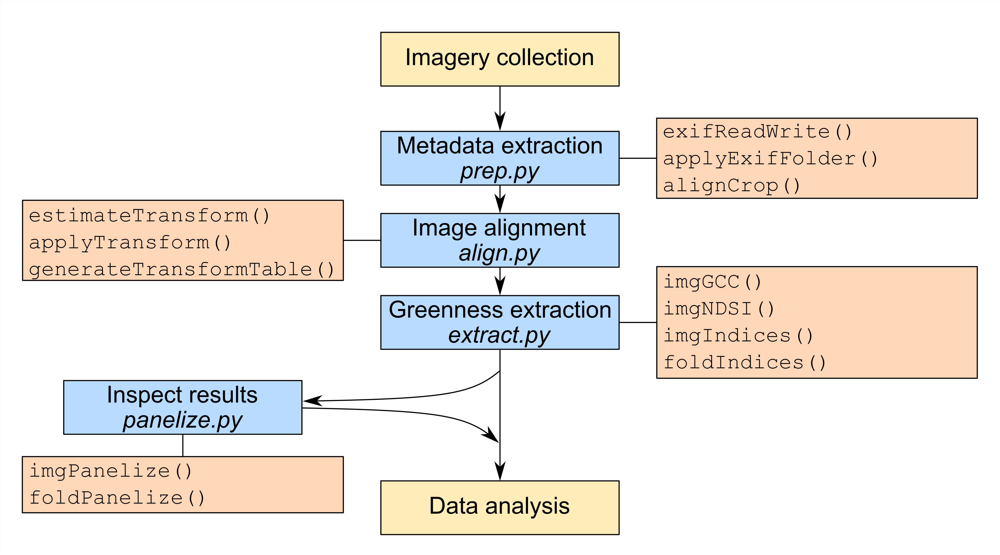

## Overview

drpToolkit is a digital repeat photography ("time-lapse") imagery management and analysis package for Python. With this package, you can:

*Get imagery into a useful file structure (`prep.py`)
*Align imagery to a common keyframe (`align.py`)
*Extract greenness from regions of interest (`extract.py`)

The motivation for this is my own work applying digital repeat photography in phenology research. There are several other applications for which it may be useful, in particular those with goals relating to change detection.

## Citation

For now, please cite the github package directly.

## Installation

`drpToolkit` was designed in Python 3.7, so please be sure to have a  recent Python version before trying to use it. It also has several dependencies, which are listed in `drpToolkit_conda_env.yml`. These can all be installed at once using a `conda` virtual environment (requires [Anaconda](https://www.anaconda.com/products/individual)):

`conda env create -f drpToolkit_conda_env.yml`

`conda activate drpToolkit`

Once the environment is activated, you can use the scripts in `drpToolkit_scripts/`. To call functions directly in Python, you will need to install using pip.

## Examples

Module scripts can be called directly from the command line, and each script has some helpful documentation that's worth checking out before getting started:

`python3 prep.py -h`

The workflow is as follows: First, prepare imagery for alignment by copying images to a new directory with filename based on image metadata, and (if desired) cropping and resizing to a smaller alignment window.

`python3 prep.py -i data/img -g *.JPG -s 'GB' -p '03' --xmin 0 --xmax 4224 --ymin 0 --ymax 2217 --width 4224  --height 2217 -o prepped`

Next, align images to a common reference image ("keyframe"). This step is computationally expensive and will take a while, especially for datasets that contain many pictures and/or datasets with large pictures. If desired, a reference image mask (-m) can be used, which defines acceptable areas of the image in which keypoints can be identified.

`python3 align.py -i data/img/prepped/ -k data/roi/reference.JPG -o aligned`

At this point I recommend checking the alignment. I use [ffmpeg](https://www.ffmpeg.org/) to compile all aligned images into a single time-lapse video using:

`ffmpeg -pattern_type glob -i 'data/img/prepped/aligned/*.JPG' -r 12 -s hd1080 -crf 32 -vcodec h264 -pix_fmt yuv420p -loglevel warning ./TIMELAPSE.mp4`

If the alignment looks good, greenness within a set of regions of interest can be extracted. Greenness extraction produces a [tidy](https://cran.r-project.org/web/packages/tidyr/vignettes/tidy-data.html) dataset with a row for each image/ROI pair (so nrows = nImg*nROI). 

`python3 extract.py -i data/img/prepped/aligned -g *.JPG -r data/roi/ROIs.csv`

It's possible that you will get RuntimeWarnings during `extract.py` if an ROI overlaps with empty space in a realigned image. You can identify which region(s) lost coverage in the imagery using the `GCC.csv` output file from `extract.py` or from the `pd.DataFrame` returned by `extract.imgGCC()` and `extract.foldGCC()`.

## Version

The current version is v0.0.1. With feedback from peer review, we will update the software and release v0.1.0.

## License

This software is distributed under a [GNU General Public License 3.0](https://www.gnu.org/licenses/gpl-3.0.en.html). 

## Contact

Bug reports? Report an issue on github.
Questions? Contact [Christian John](mailto:cjohn@ucdavis.edu). 

